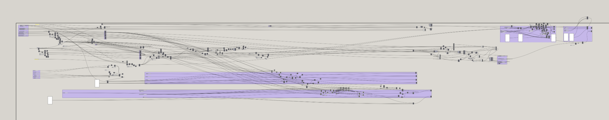

# py2gh: Python to Grasshopper

Write Python, get a Grasshopper definition (`.ghx`) you can open in Rhino, and read
one back the other way too. It is a small compiler between code and the
Grasshopper node editor.

A real Grasshopper definition can grow into a wall of nodes and wires that is hard to
read, diff, or edit by hand. Writing the same logic in Python keeps it legible.



*the great spaghetti monster*

```bash
pip install -e .
py2gh examples/simple_math.py -o out.ghx
```

```python
# examples/simple_math.py
a = 3.0
b = 5.0
half_perimeter = (a + b)
area = half_perimeter * 2.0
```

becomes a canvas of Number Sliders feeding Addition and Multiplication components
into an output Panel.

It also runs in reverse: read a `.ghx` back into a structured description or
best-effort Python.

```bash
py2gh --describe   truss2d.ghx            # structured inventory of the definition
py2gh --to-python  truss2d.ghx -o out.py  # best-effort Python reconstruction
```

A binary `.gh` is the same data model as a `.ghx`; export `.ghx` from Grasshopper
(File > Save As) and either mode reads it.

`examples/truss2d.ghx` is a real 45-component parametric 2D truss. Its `--describe`
inventory (`examples/truss2d.describe.txt`) and `--to-python` reconstruction
(`examples/truss2d.py`) are checked in to show the reverse pipeline on a non-trivial
definition. Native geometry/solid components (Divide Curve, Iso Curve, Pipe, Solid
Union, and so on) surface as `gh(...)` placeholders; the dataflow, slider values,
typed-in (persistent) input values, and multi-output wiring all survive. Structured
geometry typed into an input (interval, plane, point, vector) is decoded to its
values; a geometry blob (`gh_bytearray`) is deflate-decompressed just far enough to
read its type, so it shows as e.g. `internal("Brep")` rather than opaque bytes.
Reconstructing a blob's exact coordinates needs Rhino/GH_IO (it is a RhinoCommon goo
archive, not a standalone OpenNURBS `.3dm`, so `rhino3dm` can't decode it either).

## How it works

```
Forward:  Python source -> AST analyzer -> IR graph -> .ghx emitter -> Grasshopper
                           (analyzer.py)   (ir.py)     (emitter.py)

Reverse:  Grasshopper -> .ghx reader -> IR graph -> describe.py  (structured report)
                         (reader.py)             -> decompile.py (best-effort Python)
```

The IR graph is the hub: the reader rebuilds the same graph the emitter consumes,
so forward and reverse share one model. Components with a native Python meaning
decompile to real code; anything else becomes a `gh("Name", ...)` placeholder so the
output is always complete. Decoupling "what Python means" from "what a `.ghx` looks
like" lets either end change independently, and new source languages or output
formats plug in at the seam.

A wire in a `.ghx` is not a top-level element. It lives on the downstream input as a
`Source` item referencing the upstream object's GUID. The emitter reproduces that
exactly (verified against a real Grasshopper export).

## Current status

Works and tested: 64 passing tests across the forward path (Python to `.ghx`) and
the reverse path (`.ghx` to description plus best-effort Python). The output is
structure-validated item-for-item against a real Grasshopper export, and it handles
real definitions (a 45-component truss, a 467-component dome) and returns a readable
inventory.

Still drafting / not confirmed: most component GUIDs are `VERIFY` placeholders until
harvested from a running Grasshopper (`py2gh --check-guids` lists them). Opening a
generated `.ghx` in Rhino 8 to confirm a full round-trip needs a machine with Rhino
and hasn't been done yet. Reading binary `.gh` directly is still to do (for now,
Save As `.ghx` first).

Ideas: harvest the remaining GUIDs, native binary `.gh` via GH_IO.dll, auto-layout
that doesn't pile nodes on top of each other, and a GhPython escape hatch so any
Python round-trips even when there is no native component for it.

### What it supports (and what it refuses)

Built against a real export (GH 0.9+, ArchiveVersion 0.2.2): Number Slider, Panel,
and operator serializations match item-for-item, and operator-to-operator wiring
resolves through `param_output` GUIDs (not node GUIDs; getting that wrong silently
breaks every wire). Supported Python:

- numeric literals (become sliders), names, unary minus
- binary ops `+ - * / ** %`
- math calls `sin`, `cos`, `sqrt`, `abs`
- comparisons `< <= > >= == !=` (each lowers to a Larger/Smaller/Equality component;
  the `...=` forms reuse the component's second boolean output)
- booleans `and`, `or`, `not` (become Gate And/Or/Not; chains fold pairwise)
- boolean literals `True` / `False` (become Boolean Toggle)
- tuples `(x, y[, z])` (become Construct Point), and `vector(x, y, z)` (becomes
  Vector XYZ); a 2-tuple pads Z with a zero slider
- list literals `[a, b, c]` (become a Merge component, a Grasshopper list)
- geometry / utility calls: `line`, `polyline`, `divide_curve`, `end_points`,
  `deconstruct`, `iso_curve`, `join_curves`, `offset_surface`, `pipe`,
  `solid_union`, `unit_z`, `cull_index` map to their components both ways, so a small
  truss can be written directly in Python (see `examples/mini_truss.py`) and the
  same calls round-trip back out of a `.ghx`

Unsupported constructs (control flow, multi-target assignment, chained comparisons,
unknown calls) raise a clear error with a line number.

Confirmed component GUIDs: Addition, Multiplication, Negative, Number Slider, Panel.
Still need harvesting (`py2gh --check-guids`): the remaining arithmetic
(Subtraction, Division, Power, Modulus), trig (Sine, Cosine, SquareRoot, Absolute),
and every component added in M2 (Larger/Smaller Than, Equality, Gate And/Or/Not,
Construct Point, Vector XYZ, Merge). The structural machinery (graph, wiring, XML)
is fully tested regardless; only whether Grasshopper can resolve an unconfirmed GUID
is at stake. The bundled `examples/simple_math.py` uses only confirmed components, so
it opens cleanly; run `tools/harvest_components.py` in Grasshopper to fill the rest.

Note: a wrong GUID floats around online for Multiplication (`ce46b74e...`); the value
read from a real file is `b8963bb1...`. This is why GUIDs are harvested, not trusted
from memory.

## Roadmap

- M0, skeleton (done): AST to IR to `.ghx`, arithmetic, sliders/panels, tests, CLI.
- M1, open-in-Rhino correctness (mostly done): serialization rebuilt to match a real
  export item-for-item (alphabetical items, `Bounds` plus `Pivot` attributes, real
  Slider/Panel/operator chunks); wiring fixed to cite `param_output` GUIDs; core
  GUIDs confirmed from a real file. Remaining: harvest the last operator/trig GUIDs,
  and open the output in Rhino 8 to confirm round-trip.
- M2, coverage (in progress): comparisons and booleans, tuples to points/vectors,
  and list literals to GH lists are done (analyzer, IR, emitter, fully tested).
  Remaining: harvest the new components' GUIDs, and add `rhino3dm` geometry calls to
  geometry components.
- M3, control flow: map list comprehensions to data-tree operations; detect regions
  that can't be lowered and wrap them in a single GhPython component (the escape
  hatch) so any Python still round-trips.
- M4, fidelity and UX (in progress): round-trip `.ghx` to Python is done
  (`reader.py`, `describe.py`, `decompile.py`, `--describe` / `--to-python`), reusing
  the IR so forward and reverse share one model. Remaining: auto-layout that doesn't
  overlap, groups/labels from comments, binary `.gh` I/O (via GH_IO.dll, so no manual
  `.ghx` export step).
- M5, packaging: PyPI release, optional Rhino.Compute hook to execute and screenshot
  the result for CI.

## Tests

```bash
python -m pytest -q
```
